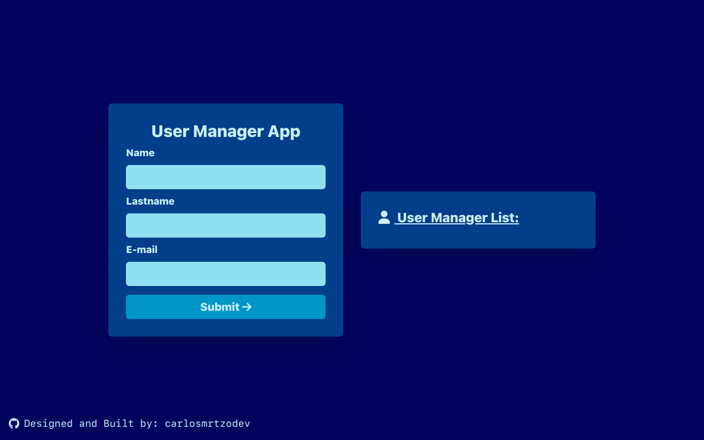

## 📄 Intro.

<div align="center">
Simple User Manager App in React.js and Tailwind CSS. <br><br>
</div>

[](https://simple-user-manager.vercel.app/)

## 💼 Used technologies


## 🚨 Forking this repo

You can fork this repo without no problem, enjoy :).

## 🛠 Installation & Set Up

1. Install dependencies

   ```sh
   npm install
   ```

2. Start the development server

   ```sh
   npm start
   ```

## 🚀 Building and Running for Production

1. Generate a production build

   ```sh
   npm run build
   ```
